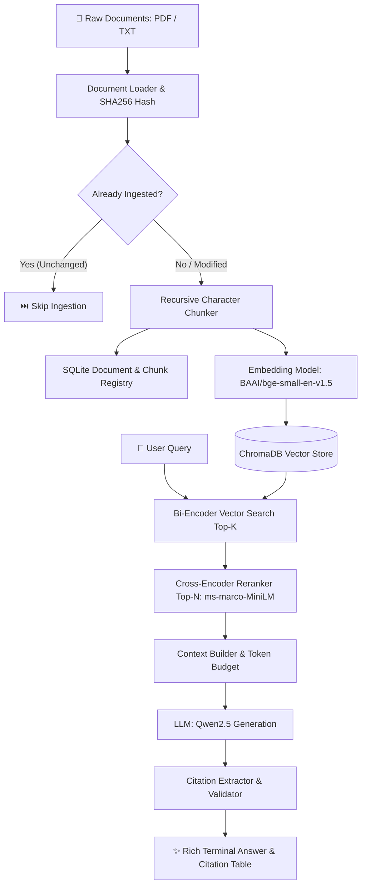

# terminalRAG

<p align="center">
  
  
  
  
  
  
</p>

---

**terminalRAG** is a modular, Terminal Vector Retrieval-Augmented Generation (RAG) system built in Python. It provides a rich terminal CLI with **two-stage retrieval** (Bi-Encoder Dense Retrieval + Cross-Encoder Reranking), **verifiable bracket citations**, **content-hash deduplication**, and **local open-source LLM generation** (e.g. Qwen 2.5).

---

## ✨ Key Features

- 📂 **Multi-Format Ingestion**: Supports `.pdf` (with page-level chunk extraction via `pypdf`) and `.txt` documents.
- 🔒 **SHA256 Content Deduplication**: Avoids redundant processing and vector index bloat by skipping unmodified files. Automatically replaces chunks upon file modification.
- 🧩 **Hierarchical Recursive Chunking**: Configurable chunk size and overlap with intelligent character-level and sentence-level boundary fallback.
- 🗄️ **Dual Storage Architecture**:
  - **SQLite Registry**: System-of-record for document metadata, file hashes, timestamps, and relational chunk mapping.
  - **ChromaDB Vector Store**: Persistent local vector storage with cosine distance metric for sub-second semantic retrieval.
- 🎯 **Two-Stage Retrieval Pipeline**:
  - **Stage 1 (Bi-Encoder Retrieval)**: Fast retrieval of top-K candidate chunks using `BAAI/bge-small-en-v1.5` embeddings.
  - **Stage 2 (Cross-Encoder Reranking)**: Precision relevance rescoring using `cross-encoder/ms-marco-MiniLM-L-6-v2`.
- 🧠 **Context & Prompt Engineering**: Token-aware context budgeting with explicit source identifiers (`[Source 1] File: ... | Page: ...`).
- 🤖 **Local LLM Generation & Citation Correlation**:
  - Generates answers strictly grounded in retrieved sources using Hugging Face Transformers (`Qwen/Qwen2.5-0.5B-Instruct` or `Qwen/Qwen2.5-7B-Instruct`).
  - Automatically parses bracket citations (`[1]`, `[2]`, `[Source 1]`) and links them back to exact filenames and page numbers.
- 💻 **Rich Terminal Experience**: Interactive progress bars, colorful status tables, formatted error boxes with actionable remediation hints, and quiet log routing to `logs/vector-rag.log`.

---

## 🏗️ Architecture & Workflow



---

## 📁 Project Structure

```text
terminalRAG/
├── config/
│   └── config.yaml             # Main application and model configurations
├── data/                       # Local SQLite DB and persistent ChromaDB storage
│   ├── app.db                  # Metadata registry (SQLite)
│   └── chroma/                 # Vector collections (ChromaDB)
├── logs/
│   └── vector-rag.log          # Application execution & error logs
├── src/
│   └── vector_rag/
│       ├── cli/                # Unified Rich CLI implementation (main.py)
│       ├── config/             # Pydantic v2 settings & YAML loader
│       ├── embeddings/         # BaseEmbedder & SentenceTransformer implementations
│       ├── generation/         # RAGService, ContextBuilder, LLM, and CitationExtractor
│       ├── ingestion/          # DocumentLoader, Text/PDF parsers, and Chunker
│       ├── models/             # Pydantic schemas (Document, Chunk, Response)
│       ├── retrieval/          # VectorRetriever, CrossEncoderReranker, and RetrievalService
│       ├── storage/            # SQLite storage abstraction & schema migration
│       ├── utils/              # Custom domain exception hierarchy & logging
│       └── vectorstore/        # ChromaDB vector store wrapper
├── tests/
│   ├── fixtures/               # Test documents (.txt sample)
│   ├── integration/            # End-to-end and subsystem integration tests
│   └── unit/                   # Unit tests across all components (79 total tests)
├── pyproject.toml              # Build definition and CLI script entrypoint
└── README.md
```

---

## ⚡ Quick Start

### Prerequisites
- **Python**: `>= 3.10`
- **Operating System**: Windows (PowerShell / Git Bash), Linux, or macOS.

### Installation

We recommend using **[`uv`](https://github.com/astral-sh/uv)** for fast, reliable package management:

```bash
# 1. Clone repository
git clone https://github.com/<YOUR_USERNAME>/terminalRAG.git
cd terminalRAG

# 2. Create virtual environment
uv venv .venv

# 3. Activate virtual environment
# Windows (Git Bash):
source .venv/Scripts/activate
# Windows (PowerShell):
.venv\Scripts\Activate.ps1
# Linux / macOS:
source .venv/bin/activate

# 4. Install dependencies & CLI entrypoint
uv sync
```

*(Alternatively with standard pip: `pip install -e .`)*

---

## 🖥️ Terminal CLI Usage

The package provides the unified executable command `vector-rag`:

### 1. Ingest Documents
Ingest individual `.pdf` / `.txt` files or entire directories:

```bash
# Ingest single file
vector-rag ingest tests/fixtures/sample.txt

# Ingest directory recursively
vector-rag ingest data/documents/

# Force re-ingestion (bypassing hash deduplication)
vector-rag ingest tests/fixtures/sample.txt --force
```

### 2. Query with Full RAG Generation
Execute natural language queries with two-stage retrieval, local Qwen LLM answer generation, and verified source citations:

```bash
vector-rag query "What is PostgreSQL and how does MVCC work?"
```

Customizing retrieval depth:
```bash
vector-rag query "Explain Linux filesystem inodes" --top-k 10 --top-n 3
```

### 3. Fast Vector-Only Search
Retrieve raw semantically similar chunks with similarity scores without invoking the LLM:

```bash
vector-rag query "B-Tree index structure" --vector-only
```

### 4. List Registered Documents
Display all indexed documents, page counts, file sizes, and SHA256 hashes:

```bash
vector-rag list
```

### 5. Delete Documents
Delete documents from both SQLite and ChromaDB by filename or Document ID:

```bash
vector-rag delete sample.txt
```

### 6. Check System Status
Inspect active model names, vector count, and chunking parameters:

```bash
vector-rag status
```

---

## ⚙️ Configuration Reference

All settings can be customized in [`config/config.yaml`](config/config.yaml) or overridden via environment variables:

```yaml
application:
  name: "vector-rag"
  environment: "development"

storage:
  sqlite_path: "data/app.db"
  chroma_path: "data/chroma"

chunking:
  strategy: "recursive"
  chunk_size: 800
  chunk_overlap: 120

retrieval:
  top_k: 10

reranker:
  top_n: 5
  model: "cross-encoder/ms-marco-MiniLM-L-6-v2"

embedding:
  model: "BAAI/bge-small-en-v1.5"

generation:
  model: "Qwen/Qwen2.5-0.5B-Instruct"   # Or "Qwen/Qwen2.5-7B-Instruct"
  temperature: 0.0
  max_tokens: 800

logging:
  level: "INFO"
  file: "logs/vector-rag.log"
```

---

## 🧪 Testing & Quality Assurance

Run the comprehensive test suite with `pytest`:

```bash
# Run all tests
pytest

# Run with verbose output
pytest -v
```

### Test Coverage Highlights:
- **79 Automated Tests**: 100% pass rate across unit and integration tests.
- **Fast Deterministic Unit Tests**: Powered by custom `MockEmbedder`, `MockReranker`, and `MockLLM`.
- **E2E Integration Verification**: Full pipeline tested from multi-page file loading to citation resolution.

---

## 📜 License

This project is licensed under the [MIT License](LICENSE).
